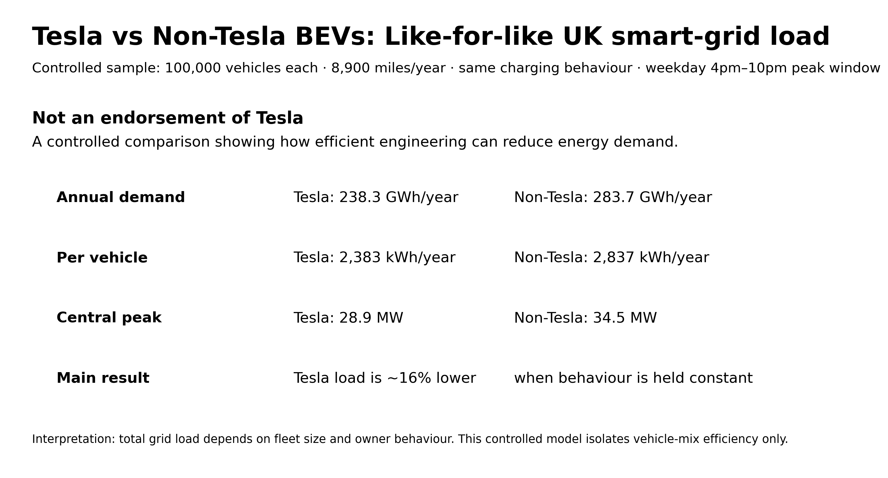

# Tesla vs Non-Tesla BEVs: Like-for-like UK smart-grid load

This repository contains a controlled UK smart-grid simulation comparing **Tesla BEVs** and **non-Tesla BEVs** under identical conditions.

The purpose is to remove the misleading effect of total fleet size and ask:

> If both groups had the same number of vehicles, same mileage and same charging behaviour, which vehicle mix would place more load on the power grid?

This is **not an endorsement of Tesla**. The research question is about whether efficient engineering can reduce annual energy demand and peak-period grid pressure when EVs scale.

## Dataset

The actual processed dataset behind the charts is included in this repo.

| Dataset | Link |
|---|---|
| Data dictionary | [`data/processed/00_data_dictionary.csv`](data/processed/00_data_dictionary.csv) |
| Annual energy comparison | [`data/processed/01_like_for_like_annual_energy.csv`](data/processed/01_like_for_like_annual_energy.csv) |
| Peak-load scenarios | [`data/processed/02_like_for_like_peak_load_scenarios.csv`](data/processed/02_like_for_like_peak_load_scenarios.csv) |
| Annual energy long form | [`data/processed/03_annual_energy_long_form.csv`](data/processed/03_annual_energy_long_form.csv) |
| Peak-load long form | [`data/processed/04_peak_load_long_form.csv`](data/processed/04_peak_load_long_form.csv) |
| Model assumptions | [`data/processed/05_model_assumptions.csv`](data/processed/05_model_assumptions.csv) |

## Final charts

The final chart outputs are stored in:

[`outputs/infographics/`](outputs/infographics/)



## Main result

Controlled sample:

- 100,000 Tesla BEVs
- 100,000 non-Tesla BEVs
- 8,900 miles per vehicle per year
- Same weekday 4pm–10pm peak window
- Same charging behaviour
- Same smart-charging profiles and peak-shifting assumptions

Only the **weighted vehicle-mix efficiency** differs.

| Group | Weighted efficiency | Annual kWh/vehicle | Annual GWh for 100k vehicles |
|---|---:|---:|---:|
| Tesla | 26.8 kWh/100 miles | 2,383 | 238.3 |
| Non-Tesla BEVs | 31.9 kWh/100 miles | 2,837 | 283.7 |

## Smart-grid peak comparison

| Charging profile | Tesla MW | Non-Tesla MW | Extra non-Tesla MW | Tesla lower by |
|---|---:|---:|---:|---:|
| Smart/off-peak | 12.6 | 15.0 | 2.4 | 16.0% |
| Central smart-grid proxy | 28.9 | 34.5 | 5.5 | 16.0% |
| Unmanaged/high peak | 51.1 | 60.9 | 9.7 | 16.0% |

## Interpretation

Under identical owner behaviour and smart-grid assumptions, the non-Tesla BEV sample draws around **16% more power** than the Tesla sample.

This does **not** prove Tesla owners charge at better times. It isolates the vehicle-mix efficiency effect.

## Folder structure

```text
.
├── README.md
├── data/
│   └── processed/
│       ├── 00_data_dictionary.csv
│       ├── 01_like_for_like_annual_energy.csv
│       ├── 02_like_for_like_peak_load_scenarios.csv
│       ├── 03_annual_energy_long_form.csv
│       ├── 04_peak_load_long_form.csv
│       └── 05_model_assumptions.csv
├── docs/
│   ├── METHODOLOGY.md
│   └── SOURCES_AND_LIMITATIONS.md
├── outputs/
│   ├── infographics/
│   └── tables/
└── src/
    ├── build_like_for_like_model.py
    └── make_infographics.py
